# 🏥 California Hospital Medical Center — End-to-End Analytics & Revenue Cycle Intelligence
### Enterprise Relational Engineering (MySQL 8.0) to Interactive Executive BI (Power BI)

**Author:** Roshan Kumar  
**GitHub:** [ROSHAN-KJ](https://github.com/ROSHAN-KJ)

[](https://github.com/ROSHAN-KJ)
[](https://www.mysql.com/)
[](https://powerbi.microsoft.com/)
[](#)
[](https://fhir.org)

> ⚠️ **HIPAA & Data Privacy Disclaimer:** All datasets utilized in this project are 100% synthetic and generated strictly for demonstration and portfolio purposes. No real Protected Health Information (PHI) or personally identifiable information is included.

---

## 📌 Project Overview
This project showcases an end-to-end healthcare data engineering and business intelligence pipeline built on a relational database (**9 core source tables, 126,000+ records** covering **70,000 encounters** and **24,000 inpatient stays** across Q1 2025).

The project integrates two layers of the analytics lifecycle:
1. **Upstream Engineering & Transformation (MySQL 8.0):** Ingested unformatted CSV files, enforced primary/foreign key integrity, developed denormalized master views, and executed deep diagnostic SQL queries.
2. **Downstream Modeling & Executive BI (Power BI & DAX):** Designed a constellation star schema with custom-generated DAX calculated tables (including a custom date dimension), dynamic context-transition measures, and built an interactive **7-page dashboard suite with 2 dedicated drill-through views**.

---

## 🎯 Core Business Questions Addressed

### Operational Throughput & Capacity
* What is the patient admission split between Inpatient, Outpatient, Emergency, and Telehealth services?
* How does patient volume fluctuate across clinical departments and age cohorts over time?
* What is the Average Length of Stay (ALOS), and what proportion of admissions represent standard 3-day recovery windows?

### Financial Performance & Revenue Leakage
* Out of **$112.90M** in total billed charges, what portion is covered by insurance versus out-of-pocket patient liability?
* What is the hospital's gross financial leakage due to denied claims, and what is the overall unrecovered loss rate?
* Which commercial and public insurance payers generate the highest volume and dollar impact of claim rejections?

### Clinical Quality & Risk Stratification
* What is the hospital’s all-cause **30-day readmission rate**, and how are readmission risks segmented across encounters?
* What proportion of patients present severe chronic conditions or high-risk **polypharmacy ($\ge 3$ active prescriptions)**?
* Which service lines demonstrate the highest diagnostic intensity and abnormal lab test rates?

### Physician & Staffing Workload
* How are the hospital's **1,490 active providers** utilized across clinical departments?
* What is the average patient encounter load per provider, and where are operational imbalances emerging?

---

## 🗂️ Repository Structure

```text
ca_hospital_MySQL_analysis/
│
├── data/
│   └── raw/                                # Original 9 unedited CSV datasets
│
├── docs/                                   # Schema documentation & Excel Data Dictionary
│
├── sql/                                    # Modular MySQL pipeline scripts
│   ├── 01_ddl_and_ingestion.sql
│   ├── 02_primary_keys.sql
│   ├── 03_foreign_keys.sql
│   ├── 04_cleaning_and_transformation.sql
│   ├── 05_business_views.sql
│   └── 06_analysis_queries.sql
│
├── images/                                 # SQL query outputs & screenshots
│   ├── financial_denials.png
│   ├── alos_by_department.png
│   ├── seasonal_trends.png
│   └── powerbi/                            # High-resolution Power BI dashboard views
│       ├── 00_data_model.png
│       ├── 01_overview.png
│       ├── 02_revenue_cycle.png
│       ├── 03_hospital_losses.png
│       ├── 04_clinical_operations.png
│       ├── 05_treatment_metrics.png
│       ├── 06_patient_outcomes.png
│       ├── 07_patient_insights.png
│       ├── 08_financial_drillthrough.png
│       └── 09_hospital_loss_drillthrough.png
│
├── dax/
│   └── measures.dax                        # Centralized DAX formula catalog
│
├── powerbi/
│   └── DignityHealth_CA_Hospital_Report.pbix # Interactive Power BI workbook (13 MB)
│
└── README.md                               # Project documentation
```

---

## 🚀 Part 1: Relational Database Engineering (MySQL 8.0)

### Local Data Ingestion Setup
This project utilizes MySQL's `LOAD DATA INFILE` for high-performance bulk loading. To replicate this database locally:

1. **Verify Privileges:** Ensure your MySQL server allows local file loading by running `SHOW VARIABLES LIKE 'secure_file_priv';`.
2. **Update Paths:** Open `sql/01_ddl_and_ingestion.sql` and update the source directory paths (e.g., `'C:/path/to/your/data/raw/patients.csv'`) to your absolute local directory.
3. **Execute in Chronological Order:** Run the SQL scripts in numerical order (`01` through `06`) to establish tables, assign PK/FK constraints, and generate analytical views.

### Key SQL Concepts Demonstrated
* 💡 **Window Functions:** Implemented `DENSE_RANK()` for provider encounter load distribution and `LAG()`/`LEAD()` to determine inter-admission duration for 30-day readmission flags.
* ⏳ **Common Table Expressions (CTEs):** Structured multi-stage cohort filtering for department-level utilization and polypharmacy vulnerability.
* 📈 **Conditional Aggregation:** Applied `SUM(CASE WHEN...)` to pivot revenue cycle transactions and evaluate denial severity by payer.

### Initial SQL Query Validations
| Analysis Area | Visualization | Key Metric |
| :--- | :--- | :--- |
| **Financial Denials** | 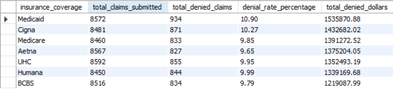 | Uncollected revenue distribution across payers |
| **Departmental ALOS** | 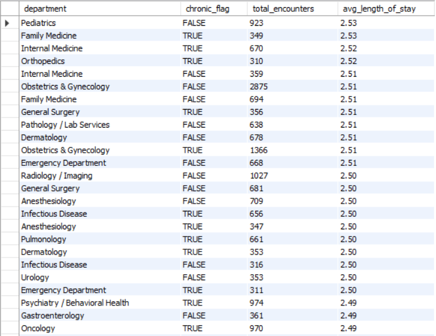 | Chronic vs. non-chronic holding time variances |
| **Seasonal Trends** | 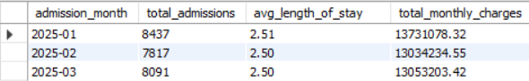 | Inpatient surge spikes and monthly volume pacing |

---

## 📊 Part 2: Enterprise Business Intelligence (Power BI)

### Constellation Data Model Architecture
The data model connects clinical events and revenue transactions through a central `Encounters` fact table:
* **Core Fact:** `Encounters` (capturing admission/discharge dates, encounter types, length of stay, and readmission interval columns).
* **Clinical Fact Sub-Models:** `Diagnoses` (ICD-10, chronic flags), `Medications`, `Lab tests` (reference outcome ranges), and `Procedures`.
* **Revenue Sub-Model:** `Claims and billing` linked to encounters, cascading into granular `Denials` records on `claim_id`.
* **Dimensions:** `Patients` (demographics, age cohorts), `Providers` (specialties), and custom-engineered calculated tables.

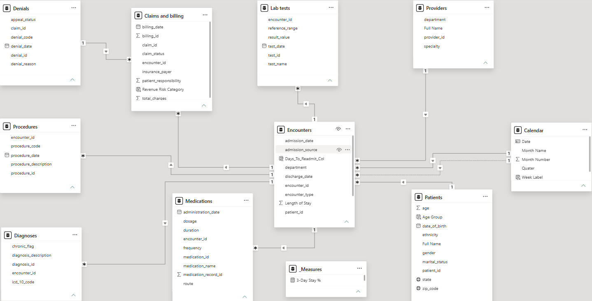
### Dashboard Navigation & Executive Views

#### 1. Overview (Executive Command Center)
Monitors high-level operational throughput (70K encounters, 24K inpatients), monthly volume pacing, and departmental intake shares.
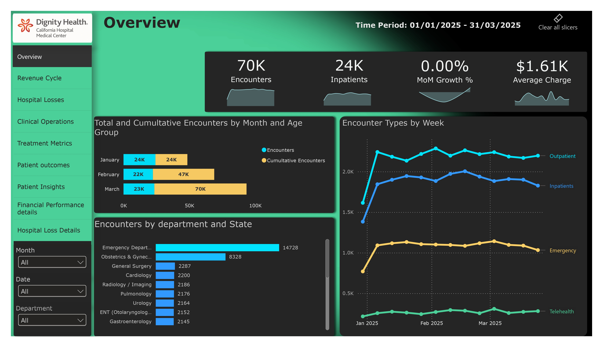

#### 2. Revenue Cycle
Audits $112.90M in billed charges, examining insurance payouts ($30.41M / 26.93%), patient liability, and 3-month rolling revenue momentum.
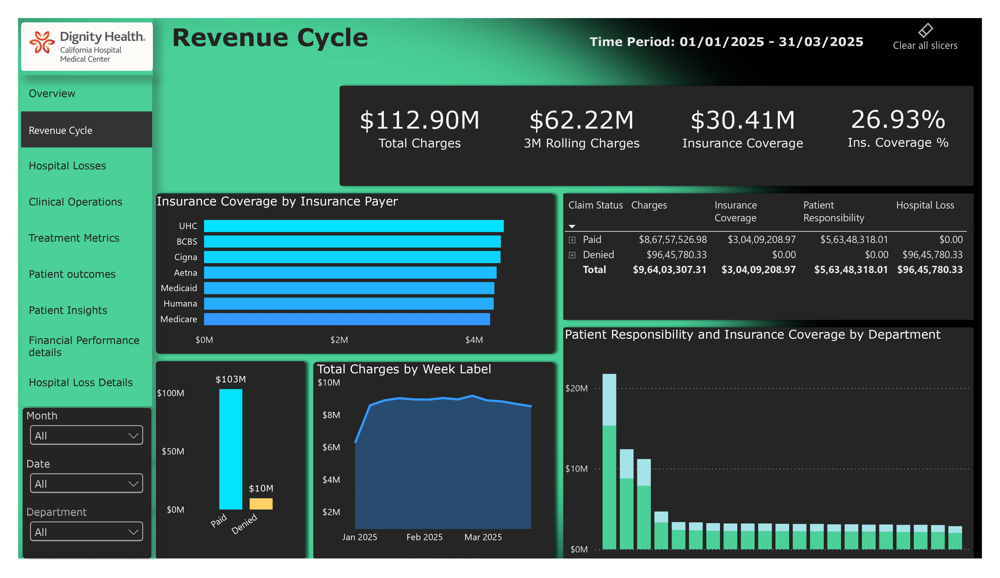

#### 3. Hospital Losses & Denial Audit
Analyzes **$9.65M in direct hospital losses (8.54% leaking percentage)**, attributing financial leakages to specific denial reasons and ranking commercial vs. public payers.
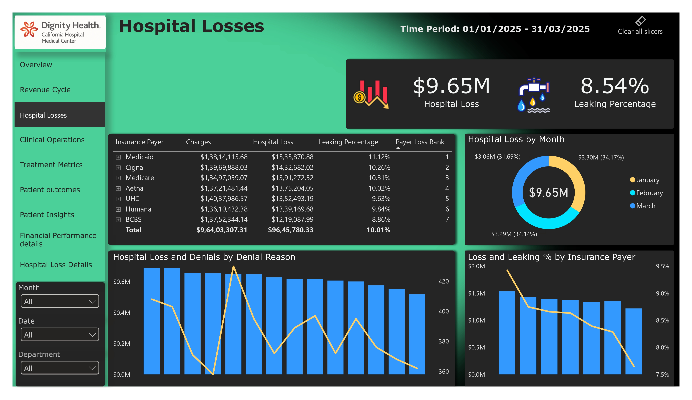

#### 4. Clinical Operations
Staffing and clinician workload tracking across 1.49K active providers, evaluating encounter loads (46.95 average) and admission source distribution.
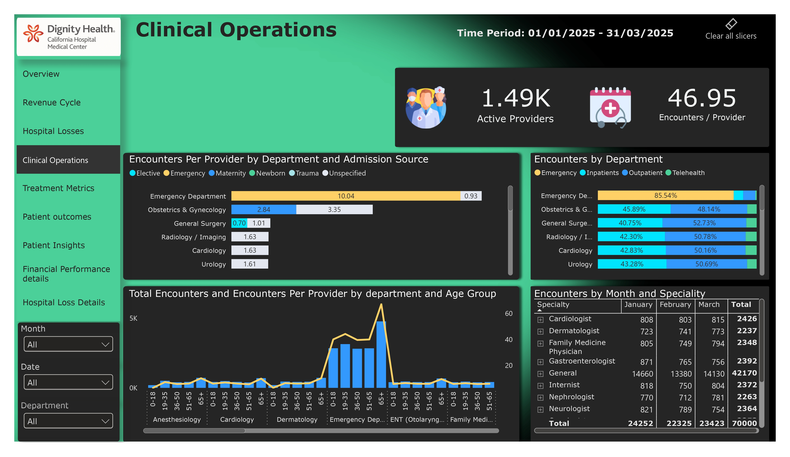

#### 5. Treatment Metrics
Clinical service line volume monitoring: 46.79% chronic condition rate, 33.13% abnormal lab tests, top medication administration, and procedure yield.
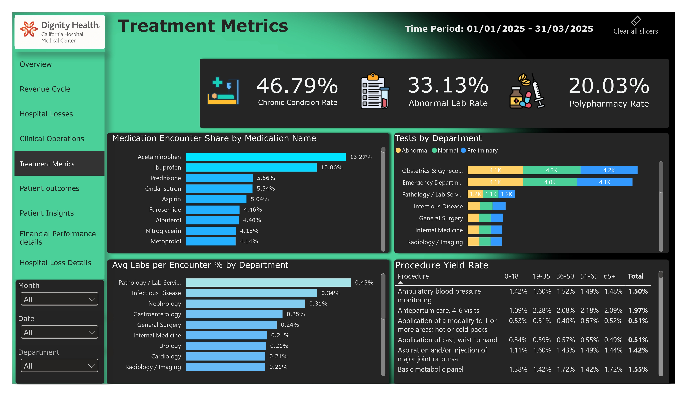

#### 6. Patient Outcomes
Clinical complexity evaluation through comorbidity scoring (46.79%), diagnostic test intensity (0.78), and high-risk polypharmacy encounters (20.03%).
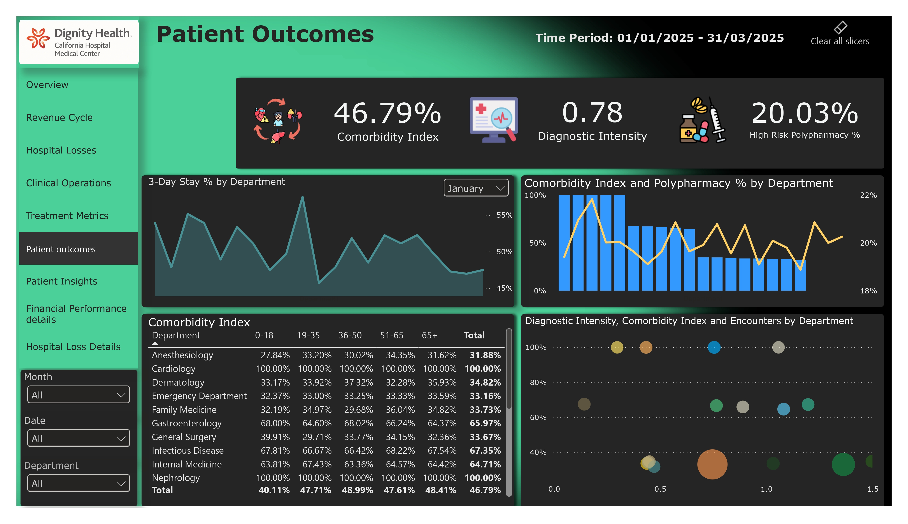

#### 7. Patient Insights
Quality compliance matrix monitoring the **3.08% 30-day readmission rate**, readmission categories, age/ethnicity billing demographics, and geographic distribution.
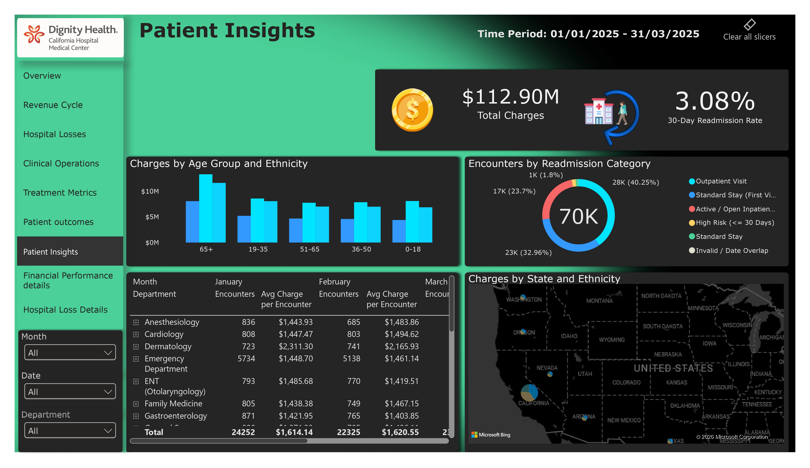

#### 8. Drill-Through: Financial Performance Details
Granular encounter-level financial auditing tracking departmental billed charges, insurance recovery, and daily run-rates.


#### 9. Drill-Through: Hospital Loss Details
Physician-level claims audit and geographic denial distributions across individual US states.
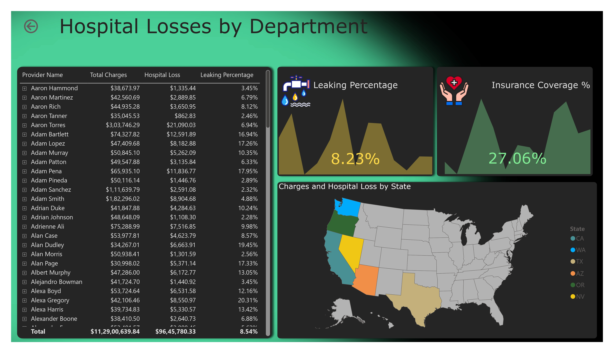

---

## 🧮 Advanced DAX Engineering Highlights

All measures are cataloged in [`dax/measures.dax`](dax/measures.dax). Key analytical expressions include:

### 1. Dynamic 30-Day Readmission Rate
Calculates all-cause 30-day readmissions by evaluating patient discharge history row-by-row across the encounters table:
```dax
30-Day Readmission Rate = 
VAR TotalDischarges = 
    CALCULATE(
        COUNT(Encounters[encounter_id]),
        NOT(ISBLANK(Encounters[discharge_date]))
    )
VAR Readmissions30Days = 
    CALCULATE(
        COUNT(Encounters[encounter_id]),
        FILTER(
            Encounters,
            NOT(ISBLANK(Encounters[discharge_date])) &&
            VAR CurrentPatient = Encounters[patient_id]
            VAR CurrentAdmission = Encounters[admission_date]
            VAR PrevDischarge = 
                CALCULATE(
                    MAX(Encounters[discharge_date]),
                    REMOVEFILTERS(Encounters),
                    Encounters[patient_id] = CurrentPatient,
                    Encounters[admission_date] < CurrentAdmission,
                    NOT(ISBLANK(Encounters[discharge_date]))
                )
            VAR DaysDiff = DATEDIFF(PrevDischarge, CurrentAdmission, DAY)
            RETURN
                NOT(ISBLANK(PrevDischarge)) && DaysDiff >= 0 && DaysDiff <= 30
        )
    )
RETURN
    DIVIDE(Readmissions30Days, TotalDischarges, 0)
```

### 2. Payer Cumulative Loss Ranking (Dynamic Pareto)
Ranks insurance payers dynamically based on total unrecovered financial leakage:
```dax
Payer Loss Rank = 
IF(
    HASONEVALUE('Claims and billing'[insurance_payer]),
    RANKX(
        ALL('Claims and billing'[insurance_payer]),
        [Hospital Loss],
        ,
        DESC,
        Dense
    ),
    BLANK()
)
```

### 3. High-Risk Polypharmacy Tracking ($\ge 3$ Concurrent Prescriptions)
Identifies clinical encounters where multi-drug regimens increase patient safety hazards:
```dax
High Risk Polypharmacy % = 
VAR EncountersWith3Plus = 
    CALCULATETABLE(
        VALUES(Medications[encounter_id]),
        FILTER(
            VALUES(Medications[encounter_id]),
            CALCULATE(COUNTA(Medications[medication_record_id]), ALLEXCEPT(Medications, Medications[encounter_id])) >= 3
        )
    )
RETURN
    DIVIDE(
        COUNTROWS(EncountersWith3Plus),
        DISTINCTCOUNT(Encounters[encounter_id]),
        0
    )
```

---

## 💡 Key Insights & Strategic Findings

* **Revenue Cycle Leakage:** Out of $112.90M total billed charges, **$9.65M was lost to denied claims (8.54% leakage rate)**. Medicaid and Cigna represented the highest total unrecovered write-offs, driven primarily by authorization and missing documentation denial codes.
* **Favorable 30-Day Readmission Threshold:** The hospital achieved a baseline **30-day readmission rate of 3.08%** across Q1 2025, with standard single encounters representing 40.25% of visits and multi-visit tracking effectively isolating high-risk returns ($\le 30$ days).
* **Polypharmacy & Comorbidity Vulnerability:** **20.03% of encounters involved polypharmacy ($\ge 3$ active prescriptions)**, aligning with a high chronic comorbidity index of 46.79%. This emphasizes the necessity for automated clinical pharmacy review during inpatient stays.
* **Operational Staffing Balance:** The 1,490 active providers handled an average of 46.95 encounters per clinician. General Medicine and Emergency departments absorbed over 55% of all throughput, indicating potential provider burnout points compared to elective surgery lines.
* **Diagnostic Test Intensity:** Average lab utilization stood at 0.78 tests per encounter, with an **abnormal result rate of 33.13%**, confirming that diagnostic lab workflows are heavily concentrated around acute triage.

---

## 🛠️ Tools & Technologies Used
* **Database & Ingestion:** MySQL 8.0, DDL Scripting, Primary/Foreign Key Integrity, `LOAD DATA INFILE`, Denormalized Views.
* **Data Modeling & Architecture:** Power BI Desktop, Constellation / Star Schema Modeling, Bi-directional / Single Filter Governance, DAX Calculated Tables.
* **Calculations & Logic:** Advanced DAX (Windowing functions, iterators `SUMX`/`AVERAGEX`, Context Modification via `CALCULATE`, `FILTER`, `ALLEXCEPT`, `USERELATIONSHIP`).
* **Version Control & Artifact Management:** Git, GitHub, Markdown.
